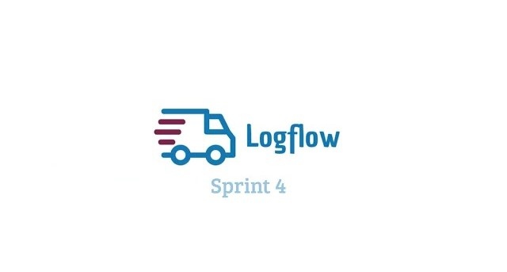

## 🏢 Empresa parceira
O projeto desenvolvido no quarto semestre teve como empresa parceira a JJM Log (atualmente NEWE Log), que atua no ramo de logística de transporte de cargas. [Site da empresa](https://newelog.com.br)

## 🔍 Problema
O problema apresentado consistia na dificuldade em rastrear as etapas de um atendimento, tornando complexa a análise de desempenho dos times e a introdução de novos membros aos processos da empresa.

## 💡 Solução
Como solução, minha equipe desenvolveu um sistema que permite acompanhar o processo de diversas ordens de serviço visualizando prazo, data de início, responsável, entre outras informações, passando por diversos setores. Através desse acompanhamento, o sistema é capaz de gerar estatísticas que auxiliam na análise de desempenho da empresa.

[GIT](https://github.com/C0demain/logflow)

  
Demonstração da aplicação

  
Clique na imagem para ver o vídeo

  

## 🧰 Tecnologias utilizadas
- Node.js - para execução da aplicação
- NestJS - para construção da API / backend
- React - para construção das páginas (frontend)
- Next.js - para melhor organização e roteamento das páginas
- Typescript - para tipagem de código com Javascript
- TailwindCSS - para estilização das páginas
- PostgreSQL - para armazenamento dos dados
- Swagger - para documentação do backend
- Docker - para deploy da aplicação
- Git e Github - para versionamento do código

## 🧑‍💻 Contribuições pessoais
Neste projeto, atuei como Product Owner, sendo responsável pelo contato com o cliente, exclarecimento de dúvidas do time e proposição de soluções. Por meio da construção e organização do backlog, levantei os requisitos e funcionalidades essenciais — como, por exemplo, um dashboard de tarefas com contagem de tarefas pendentes, atrasadas e concluídas. Priorizei os itens com base na importância para o cliente e defini sua distribuição ao longo das sprints.

Diante de mudanças frequentes nas etapas de atendimento trazidas pelo cliente, propus e implementei uma funcionalidade que permite aos administradores configurar processos personalizados por meio de templates com diferentes etapas e tarefas. Essa solução tornou a aplicação flexível o suficiente para atender múltiplos fluxos da empresa sem exigir alterações no código.

### 🔧 Hard Skills
Durante esse projeto, exercitei as seguintes Hard Skills:
- Node.js - Uso com autonomia;
- NestJS - Uso com autonomia;
- React - Uso com autonomia;
- Next.js - Uso com ajuda;
- Typescript - Uso com autonomia;
- TailwindCSS - Uso com autonomia;
- PostgreSQL - Uso com ajuda;
- Swagger - Uso com autonomia;
- Docker - Uso com ajuda;
- Git e Github - Uso com autonomia;

### 🗣️ Soft Skills
Como Product Owner, exercitei habilidades como escuta ativa, comunicação clara e tomada de decisão centrada no cliente. Mesmo com mudanças frequentes, mantive o time alinhado e propus soluções que equilibravam valor de negócio com a sustentabilidade do time — como a criação de uma funcionalidade que aumentou a autonomia do cliente sem gerar retrabalho constante da equipe de desenvolvimento. 
