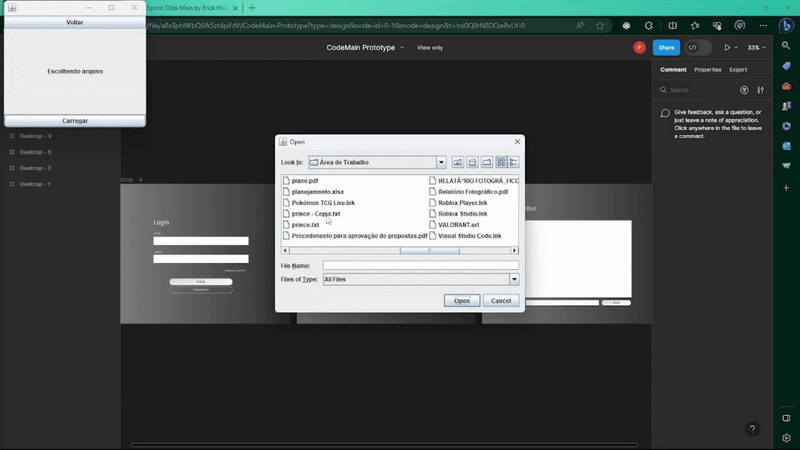

## 🏢 Empresa parceira
O projeto desenvolvido no segundo semestre teve como empresa parceira a própria Fatec, onde o Profº Giuliano Araújo Bertoti atuou como cliente final. 

## 🔍 Problema
O problema apresentado consistia na demora para consulta de informações contidas em documentos da empresa como relatórios, manuais, normas, entre outros. 

## 💡 Solução
Como solução, minha equipe desenvolveu um chatbot empresarial capaz de receber documentos em PDF e TXT e responder perguntas baseadas nesses documentos, de maneira que um funcionário poderia rapidamente consultar uma norma ou resultado de um relatório

[GIT](https://github.com/C0demain/ParrotAI)

  
Demonstração da aplicação

  

    
  

## 🧰 Tecnologias utilizadas
- Java - para construção da aplicação
- Gradle - para controle de dependências
- MySQL - para armazenamento de informações
- Git e Github - para versionamento do código
- langchain4j - para interação e memória de modelos LLM em Java

## 🧑‍💻 Contribuições pessoais
Neste projeto, atuei como Dev, contribuindo na realização de tarefas e construção da aplicação durante as sprints. Trabalhei na implementação do cadastro de usuários no sistema, desenvolvendo a interação com o banco e a interface, além de ajustar a integração desses dados com outras telas.

Outro ponto de destaque foi a implementação de um método para navegação entre as telas da aplicação, que não possuíam uma maneira uniforme e prática de navegar de uma tela para outra. A solução que eu implementei foi a criação de controller de telas junto de uma classe base para as telas onde, com conceitos de herança e polimorfismo, permitiram navegar de maneira fácil entre as telas, além de permitir o compartilhamento de informações entre elas, como por exemplo, o usuário logado.

### 🔧 Hard Skills
Durante esse projeto, exercitei as seguintes Hard Skills:
- Java - Uso com autonomia;
- MySQL - Uso com ajuda;
- Git e Github - Uso com autonomia;

### 🗣️ Soft Skills
Durante esse projeto precisei ter autonomia e proatividade para a realização das tarefas, uma vez que não havia tido muito contato com Java, apesar de já conhecer conceitos de orientação a objetos. Através da comunicação com a equipe, pude compreender melhor as tecnologias e colaborar no projeto mantendo a entrega de resultados.
