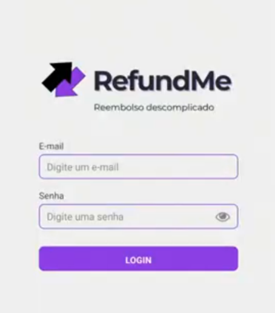
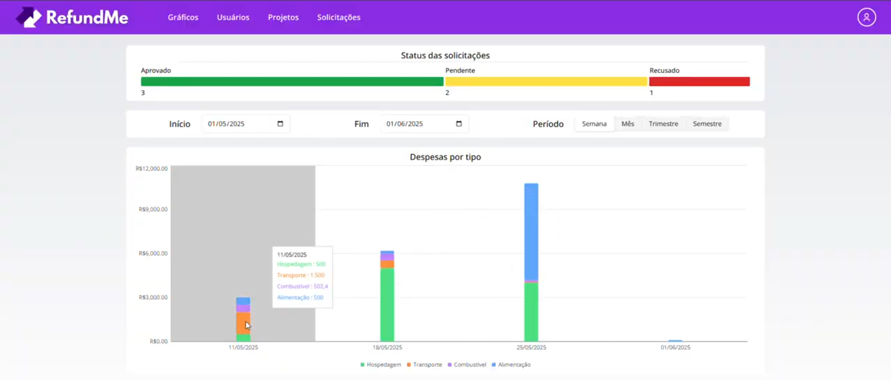

## 🏢 Empresa parceira
O projeto desenvolvido no sexto semestre teve como empresa parceira a Xertica.ai, que atua no ramo de desenvolvimento de soluções utilizando IA. [Site da empresa](https://www.xertica.ai/pt-br)

## 🔍 Problema
O empresa possuía um projeto que demandava uma solução que pudesse fornecer a pacientes de uma empresa de nutrição um atendimento personalizado e simples, de maneira mais automatizada e de fácil acesso, mas que ainda garantisse um atendimento preciso de acordo com as condições de saúde do paciente.

## 💡 Solução
Como solução, desenvolvemos um agente conversacional especializado em nutrição, onde o paciente pode, através de um chat, receber orientações personalizadas de acordo com suas condições de saúde e objetivos, além de dietas personalizadas e acompanhamento semanal utilizando uma abordagem AI-first.

[GIT](https://github.com/C0demain/nutriXpert)

🚧 A FAZER 🚧

  
Demonstração da aplicação

  
Clique nas imagens para ver os vídeos de demonstração da aplicação

  <a href="https://drive.google.com/file/d/1HBDjYvhVGboCoM4Exfvte7C8HXG5gqei/view?usp=sharing" target="_blank">
  

  

## 🧰 Tecnologias utilizadas
- Vue + Nuxt - para construção da interface web
- Typescript - para tipagem de código com JavaScript
- TailwindCSS - para estilização personalizada da interface
- Java + Spring Boot - para construção da API / backend
- PostgreSQL - para armazenamento de dados
- Python - para construção do agente de Inteligência Artificial
- Google ADK - para construção e interação do agente com os modelos de LLM (Large Language Model)
- FastAPI - para construção de API de interação com o agente
- ChromaDB - para armazenamento de dados vetoriais utilizados para contexto do agente
- Git e Github - para versionamento do código

## 🧑‍💻 Contribuições pessoais
Neste projeto, atuei como desenvolvedor, contribuindo constantemente com funcionalidades focadas na experiência do usuário no frontend. Durante o desenvolvimento fui responsável por implementar proteções de acesso da interface garantindo que as informações sensíveis de saúde do paciente não sejam visualizadas indevidamente, baseadas em níveis de acesso (administrador ou paciente) e autenticação.

Além disso, também implementei funcionalidades para edição e visualização manual de informações de saúde fornecidas na anamnese pelo paciente, garantindo possíveis correções, com autonomia do paciente, em caso de informações inseridas e/ou atualizadas equivocadamente pelo agente. O mesmo foi feito para o acompanhamento de refeições e alimentos, garantindo uma medida de correção direta e simples em caso de alucinação da IA ou outros possíveis problemas. Com isso em mente, também fui responsável pela visualização do administrador sobre os chats e informações de saúde dos pacientes, garantindo um melhor acompanhamento do funcionamento do agente e suas atuações.

### 🔧 Hard Skills
Durante este projeto, exercitei as seguintes Hard Skills:
- Vue + Nuxt - Uso com autonomia;
- Typescript - Uso com autonomia;
- TailwindCSS - Uso com autonomia;
- Java + Spring Boot - Uso com ajuda;
- PostgreSQL - Uso com ajuda;
- Python - Uso com ajuda;
- Google ADK - Uso com ajuda;
- FastAPI - Uso com ajuda;
- ChromaDB - Uso com ajuda;
- Git e Github - Uso com autonomia;

### 🗣️ Soft Skills
Como desenvolvedor, mantive comunicação constante com os outros membros da equipe para manter uma boa integração entre as capacidades do agente e a experiência do usuário, garantindo que o usuário mantivesse a confiabilidade no sistema. Fui proativo em buscar exemplos de usabilidade em outras aplicações AI-first presentes no mercado para garantir uma usabilidade mais fluida e condizente com a experiência que usuário espera de uma aplicação chat com IA. Esses exemplos e melhorias foram constantemente discutidos com a equipe e, com autonomia, fui capaz de entregar uma melhor experiência ao paciente.
